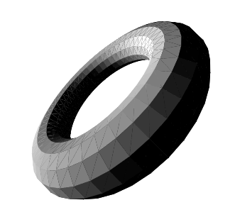

# JS 3D Engine v3
### This is my third (and best) attempt at creating a 3d engine from scratch.

This is just a demo.

This engine can load and render STL files and render them using the 2D canvas API. (The files have to be exported using the ASCII format)
So far, directional lighting, occlusion as well as translation and rotation of objects are working.
The performance is pretty bad as I have not implemented culling or any other performance improvement.



## A simple scene

```javascript
const cnv = document.querySelector('canvas');
const ctx = new RenderingContext(cnv, 400, 400);

const cam1 = new Camera(v(0, 0, -2), v(0, 0, 0));
const light1 = new DirectionalLight(v(-1, 0, 0));
const scene1 = new Scene(cam1);
const renderer = new Renderer(ctx);

const timer1 = new Timer();
const MODEL = 'assets/torus.stl';

let solid1;

async function init() {
  solid1 = new Solid(
    v(0, 0, 0),
    v(0, 0, 0),
    await readFile(MODEL)
  );

  solid1.move(v(0, 0, 2));
  scene1.addSolid(solid1, 'my-torus');
  scene1.addLight(light1);

  timer1.start();

  draw();
}

function draw() {
  requestAnimationFrame(draw);

  const t = timer1.seconds() / 2;
  solid1.rotate(v(t, t, 0));
  
  renderer.render(scene1);
}

init();
```